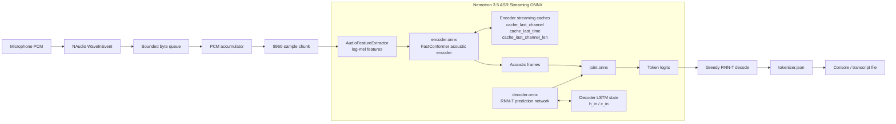
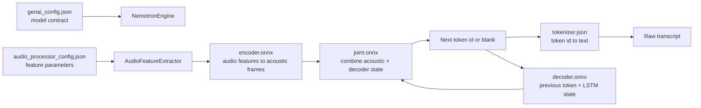
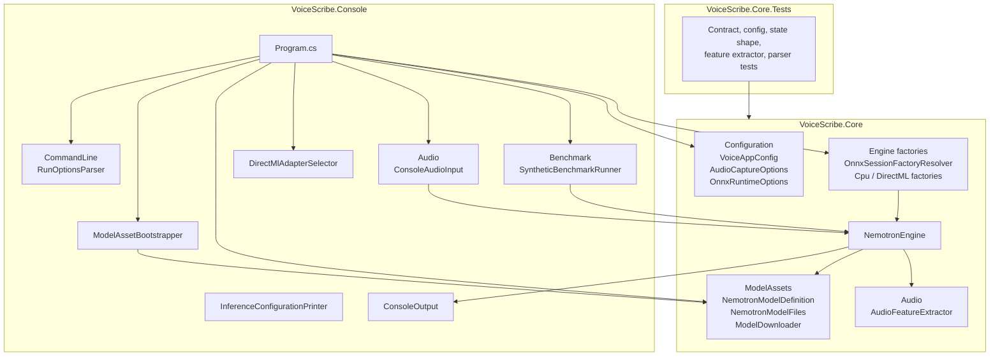
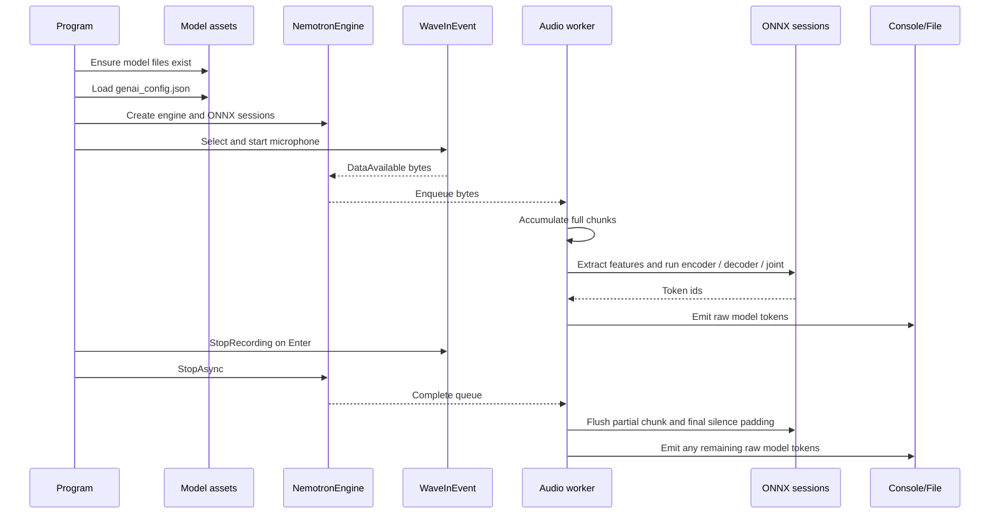

# VoiceScribe

VoiceScribe is a Windows console prototype for local, near real-time speech transcription. It captures microphone audio, converts it to log-mel features, and runs the **NVIDIA Nemotron 3.5 ASR Streaming 0.6B** ONNX export through a local RNN-T pipeline.

The application does not send audio to an external service. Internet access is only needed the first time model files are downloaded.

## Current Capabilities

- Captures PCM microphone audio on Windows with NAudio.
- Uses 16 kHz, mono, 16-bit audio by default.
- Processes 560 ms chunks, matching the model requirement of 8,960 samples.
- Builds log-mel features locally with a streaming audio preprocessor.
- Runs encoder, decoder, and joint ONNX graphs through WindowsML.
- Supports `Cpu` and `DirectMl` execution providers inside WindowsML.
- Falls back per ONNX session to CPU when DirectML cannot initialize and fallback is enabled.
- Streams transcription to the console and optionally appends it to a file.
- Includes a synthetic benchmark mode that does not require a microphone.
- Includes tests for model contract parsing, configuration validation, state shapes, and audio feature extraction.

## Requirements

- Windows.
- [.NET 10 SDK](https://dotnet.microsoft.com/download).
- A Windows-recognized microphone.
- Internet access for the first model download.
- Disk space for the ONNX model files and external data.

## Quick Start

```powershell
git clone <REPOSITORY_URL>
cd VoiceScribe
dotnet restore
```

Edit `src/VoiceScribe.Console/VoiceAppConfig.json` before the first run. The checked-in `ModelDownloadsPath` is a development-machine path and should be changed.

```json
{
  "ModelDownloadsPath": "C:/Models/nemotron-3.5-asr",
  "RepoUrl": "https://huggingface.co/onnx-community/nemotron-3.5-asr-streaming-0.6b-onnx-int4/resolve/main",
  "Audio": {
    "SampleRate": 16000,
    "BitsPerSample": 16,
    "Channels": 1,
    "BufferMilliseconds": 560,
    "SilenceThreshold": 0.003,
    "QueueCapacity": 8,
    "TrailingSilenceChunks": 0,
    "FinalSilencePaddingChunks": 4
  },
  "Inference": {
    "ExecutionProvider": "DirectMl",
    "EncoderProvider": null,
    "DecoderProvider": null,
    "JoinerProvider": null,
    "DeviceId": 0,
    "GpuMemoryLimitMiB": null,
    "AllowCpuFallback": true,
    "EnableProfiling": false,
    "LogSeverityLevel": "Error",
    "LogVerbosityLevel": 2
  },
  "Nemotron": {
    "LanguageId": 101,
    "MaxSymbolsPerStep": null,
    "BlankId": null
  }
}
```

Run the app:

```powershell
dotnet run --project src/VoiceScribe.Console
```

If model files are missing, VoiceScribe asks for confirmation before downloading them. Once the model is loaded, select a microphone if more than one is available, speak clearly, and press `Enter` to stop.

To append transcription output to a file:

```powershell
dotnet run --project src/VoiceScribe.Console -- transcript.txt
```

## Build and Test

```powershell
dotnet build VoiceScribe.sln
dotnet test VoiceScribe.sln
```

Run the synthetic benchmark:

```powershell
dotnet run --project src/VoiceScribe.Console -- --benchmark 20
```

The benchmark generates deterministic PCM chunks and sends them through the same `NemotronEngine` used by live capture.

## Architecture

### Nemotron Streaming Pipeline



The model is split into three ONNX graphs. The encoder consumes log-mel audio features and updates acoustic streaming caches. The decoder keeps linguistic recurrent state. The joint graph combines one encoder frame with the current decoder output, and greedy decoding emits tokens until the blank token stops the current acoustic frame.

Small model-file view:



### Program Structure



Main runtime flow:



Projects:

| Project | Responsibility |
| --- | --- |
| `VoiceScribe.Console` | Application startup, command-line options, logging, microphone selection, capture, benchmark mode, and model download flow. |
| `VoiceScribe.Core` | Configuration, model contract loading, audio feature extraction, ONNX session management, streaming state, RNN-T decode, and tokenization. |
| `VoiceScribe.Core.Tests` | Unit tests for model contracts, configuration validation, tensor state behavior, and feature extraction. |

## Key Design Decisions

### Model Contract

Model-specific values are loaded from `genai_config.json` and ONNX metadata instead of being duplicated in the engine. This includes graph file names, input and output names, sample rate, chunk size, hidden sizes, `blank_id`, and `max_symbols_per_step`.

`VoiceAppConfig.json` is used for operational settings and explicit overrides only.

### Audio Preprocessor

The model expects log-mel features, not raw PCM. VoiceScribe implements the preprocessor locally in `AudioFeatureExtractor` so the live microphone path can feed the ONNX encoder directly.

The extractor reads `audio_processor_config.json`, with `genai_config.json` used as fallback for model-level values. The standard export uses:

- 16,000 Hz sample rate.
- 8,960 samples per chunk.
- 560 ms chunks.
- 512-point FFT.
- 400-sample Hann window.
- 160-sample hop length.
- 128 mel bins.
- Slaney-style mel filter normalization.
- Optional dithering and preemphasis.
- Nine cached pre-encoder feature frames.

Each standard chunk produces 56 current frames plus nine cached frames, resulting in an encoder input tensor shaped `[1, 65, 128]`.

### Streaming and Concurrency

`WaveInEvent.DataAvailable` only copies received bytes into a bounded queue. It does not run feature extraction or ONNX inference.

A single worker drains the queue, preserves audio order, accumulates partial PCM fragments until a full model chunk is available, and runs the streaming pipeline. If the queue is full, the newest fragment is dropped and a warning is logged. This protects the capture callback from blocking.

On normal shutdown, the worker pads and processes the final partial chunk, then sends a configurable amount of final silence padding. This gives the streaming RNN-T state trailing context so the last spoken words are less likely to remain pending when the session ends.

### ONNX Runtime

VoiceScribe uses `Microsoft.Windows.AI.MachineLearning` as the only ONNX runtime package. `Inference.ExecutionProvider` selects providers available inside WindowsML:

- `Cpu`
- `DirectMl`

The CPU provider is included in WindowsML. CPU fallback does not require adding `Microsoft.ML.OnnxRuntime`.

With the current INT4 export, `decoder.onnx` and `joint.onnx` can initialize with DirectML, while `encoder.onnx` may fail DirectML initialization and fall back to CPU when `AllowCpuFallback` is `true`. The effective mode can therefore be hybrid:

```text
encoder = Cpu
decoder = DirectMl
joint   = DirectMl
```

The INT4 external data files are roughly:

| Graph | External data size |
| --- | ---: |
| Encoder | 658 MiB |
| Decoder | 57 MiB |
| Joint | 36 MiB |

These numbers are not final VRAM usage. ONNX Runtime may allocate transformed weights, activations, workspaces, and per-session memory arenas. `Inference.GpuMemoryLimitMiB` is validated by configuration, but this code does not currently enforce it for DirectML.

### Decoder State

The RNN-T decoder advances its recurrent state only after a non-blank token. Encoder caches and decoder LSTM states are retained across chunks and updated in place to avoid unnecessary allocations.

Dynamic ONNX dimensions are resolved based on tensor meaning, not globally converted to `1`. See [constraints.md](constraints.md) before changing audio, tensor shapes, ONNX sessions, streaming state, or shutdown behavior.

## Configuration

`VoiceAppConfig.json` is copied to the output directory at build time.

| Property | Description |
| --- | --- |
| `ModelDownloadsPath` | Local directory containing or receiving model files. |
| `RepoUrl` | Base URL used to download missing model files. |
| `ModelFiles` | Optional explicit model file list. If omitted, the built-in Nemotron file list is used. |
| `Audio.SampleRate` | Capture sample rate. Must match the model. |
| `Audio.BitsPerSample` | Integer PCM bit depth: `8`, `16`, `24`, or `32`. |
| `Audio.Channels` | Captured channel count. The engine reads the first channel. |
| `Audio.BufferMilliseconds` | Capture buffer duration. Must produce the model chunk size. |
| `Audio.SilenceThreshold` | Minimum normalized peak amplitude required for processing. |
| `Audio.QueueCapacity` | Maximum pending capture fragments. |
| `Audio.TrailingSilenceChunks` | Optional silent chunks allowed after speech before silence filtering resumes. The default `0` keeps live silence filtering unchanged. |
| `Audio.FinalSilencePaddingChunks` | Silent chunks forced during normal shutdown to flush trailing streaming context. |
| `Inference.ExecutionProvider` | Default provider: `Cpu` or `DirectMl`. |
| `Inference.EncoderProvider` | Optional provider override for `encoder.onnx`. |
| `Inference.DecoderProvider` | Optional provider override for `decoder.onnx`. |
| `Inference.JoinerProvider` | Optional provider override for `joint.onnx`. |
| `Inference.DeviceId` | GPU device id used by DirectML. |
| `Inference.GpuMemoryLimitMiB` | Optional validated setting; not currently enforced by DirectML code. |
| `Inference.AllowCpuFallback` | Recreate a failed GPU session on CPU. |
| `Inference.EnableProfiling` | Enable ONNX Runtime profiling. |
| `Inference.LogSeverityLevel` | Native ONNX Runtime log severity. |
| `Inference.LogVerbosityLevel` | Native ONNX Runtime verbosity. |
| `Nemotron.LanguageId` | Language id sent to the encoder. |
| `Nemotron.MaxSymbolsPerStep` | Optional override; otherwise read from the model contract. |
| `Nemotron.BlankId` | Optional override; otherwise read from the model contract. |

Managed application logging is configured in `src/VoiceScribe.Console/appsettings.json`.

## Known Limitations

- Windows only: the projects target `net10.0-windows10.0.18362.0`, use WindowsML, and capture through NAudio.
- No resampling. The configured capture sample rate and chunk duration must match the model contract.
- Only the first channel is processed for multichannel input.
- Silence filtering skips chunks whose peak amplitude is below `Audio.SilenceThreshold`.
- Final silence flushes streaming context on shutdown, but excessive padding can increase exit latency or emit unwanted tokens.
- Greedy RNN-T decoding only. There is no beam search, timestamping, speaker diarization, confidence scoring, or sentence segmentation.
- Partial downloads are not content-validated. Remove an incomplete model file before retrying.
- There is no automated end-to-end test that runs all three ONNX graphs with real model files.

## Troubleshooting

| Problem | Check |
| --- | --- |
| Model files are not found | Confirm `ModelDownloadsPath` and the configured model file list. |
| Download fails | Check network access, Hugging Face access, and `RepoUrl`. |
| No microphone is listed | Confirm Windows can see the device and the app has microphone permission. |
| No transcription appears | Confirm the selected microphone, input level, silence threshold, model files, and ONNX graph contract. |
| DirectML is not fully used | Check logs for per-graph CPU fallback, especially for `encoder.onnx`. |

## License and Model Terms

This repository does not currently include a license file. Add an explicit code license before redistribution, and review the separate license and usage terms for the model files published on Hugging Face.
